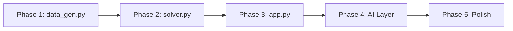

# LevelSet — Implementation Plan

**Project:** DC Outbound Smoothing  
**Author:** Mohith Kunta · [github.com/m-kunta](https://github.com/m-kunta)

---

## Tech Stack

| Layer | Choice | Rationale |
|---|---|---|
| **Language** | Python 3.9+ | Same stack as Phantom Inventory project — consistent portfolio |
| **Data** | Pandas + SQLite | Lightweight, portable, no server needed for a prototype |
| **Solver** | Greedy Heuristic Engine | Custom backward-scanning greedy algorithm that optimizes the objective function without heavy dependencies |
| **Dashboard** | Streamlit | Interactive exploration, rapid iteration, proven in the portfolio |
| **Config** | `.env` + `python-dotenv` | API keys and default parameters |
| **AI Layer** | `llm_providers.py` (port from Phantom Inventory) | Reuse existing multi-provider factory for planner insights |

---

## Build Phases

### Phase 1 — Synthetic Data Engine

**Goal:** Generate a realistic 30-day planning dataset that covers all 5 data feeds from the BRD.

**File:** `data_gen.py`

**What gets generated:**

| Table | Rows | Key Logic |
|---|---|---|
| `demand` | ~2,000 | 50 SKUs × 8 stores × ~5 need dates each. Intentionally spiky — 60% of volume lands on Mon/Tue/Wed to simulate real-world wave patterns. Each row gets a `PRIORITY` flag (20% HARD, 80% SOFT). |
| `dc_capacity` | ~90 | 3 resource types (Conveyable, Non-Convey, Bulk) × 30 operating days. Flat caps with some variation (±10%) to simulate real calendars. |
| `inventory` | ~50 | One row per SKU with `ON_HAND_AVAIL` and `ASN_ETA`. 15% of SKUs have delayed ASN (ETA after day 5) to test REQ-05. |
| `sku_master` | ~50 | `SHELF_LIFE` (3–90 days), `CASE_CUBE`, `UOM_CONV` factor. Mix of perishable and ambient. |
| `store_master` | ~8 | `BACKROOM_CAP` (pallets), `DELIVERY_CALENDAR` (valid days as comma-separated DOW string, e.g. "Mon,Wed,Fri"). |

**Seeding:** `random.seed(42)` for full reproducibility.

**Output:** `levelset.db` (SQLite)

---

### Phase 2 — Solver Engine

**Goal:** Implement the core smoothing algorithm that takes unconstrained demand and produces a constrained, smoothed ship schedule.

**File:** `solver.py`

**Architecture:**

```
┌──────────────────────────────────────────────────────┐
│                   solve(horizon_days=10)              │
│                                                      │
│  1. load_data()          → Pull all 5 feeds from DB  │
│  2. classify_orders()    → Tag HARD vs SOFT           │
│  3. check_capacity()     → Flag overloaded days       │
│  4. smooth()             → Core optimization loop     │
│  5. apply_guardrails()   → REQ-05, REQ-06 validation  │
│  6. export_plan()        → Write smoothed schedule    │
└──────────────────────────────────────────────────────┘
```

**Key functions:**

| Function | REQ | What It Does |
|---|---|---|
| `classify_orders(df)` | — | Splits demand into HARD (safety stock, promo) and SOFT (routine). HARD orders lock to their NEED_DATE. |
| `convert_units(demand, sku_master)` | REQ-02 | Converts demand units → capacity UOM (cube/pallets) using the SKU master's `UOM_CONV` and `CASE_CUBE`. |
| `check_capacity(demand, dc_cap)` | REQ-01 | Aggregates demand by day × resource and flags days where demand > capacity at both node and zone level. |
| `smooth(soft_orders, dc_cap, horizon)` | REQ-03 | The optimizer. Minimizes the objective function $Z$ by shifting soft orders to trough days within the look-ahead window. Uses a greedy scoring algorithm with Lambda/Gamma penalty terms. |
| `apply_guardrails(plan, inv, store, sku)` | REQ-04/05/06 | Post-optimization validation: frozen zone (next 48h untouchable), inventory readiness (ASN ETA check), store delivery calendar, backroom cap, MRSL/shelf-life. Reverts any violating moves. |
| `compute_kpis(before, after)` | — | Calculates CV, OSA proxy, OT estimate, cube util before and after smoothing for the dashboard. |

**Solver detail (REQ-03):**

The objective function:

$$Z = \sum_{t} (V_t - \mu_H)^2 + \lambda \cdot \text{OSA\_Penalty} + \gamma \cdot \text{EarlyShipPenalty}$$

- $V_t$ = total outbound volume on day $t$ (in capacity UOM)
- $\mu_H$ = mean daily volume across the horizon
- **OSA Penalty** = count of HARD orders that couldn't be scheduled on their need date (should be 0)
- **Early Ship Penalty** = sum of (NEED_DATE − SHIP_DATE) for all pull-forward orders — penalizes excessive early shipping

Default tuning: $\lambda = 100$ (heavy), $\gamma = 1$ (light). Configurable in `.env` or parameter master.

**Output:** `smoothed_plan` table written back to `levelset.db`

---

### Phase 3 — Streamlit Dashboard

**Goal:** Visual planning interface that shows before/after smoothing, lets planners adjust parameters, and surfaces AI insights.

**File:** `app.py`

**Layout:**

```
┌─────────────────────────────────────────────────────────────┐
│  SIDEBAR                    │  MAIN                         │
│  ─────────                  │  ─────                        │
│  DC Selector                │  📊 Before/After Volume Chart │
│  Horizon Slider (7–14 days) │     (bar chart, stacked by    │
│  Lambda / Gamma inputs      │      resource type)           │
│  Frozen Zone (hours)        │                               │
│  ───────                    │  📋 KPI Scorecards            │
│  AI Provider Selector       │     CV: 0.38 → 0.12 ✅        │
│  ───────                    │     OSA: 98.7% (maintained)   │
│  🔧 Run Solver button       │     OT: −14%                  │
│  ───────                    │                               │
│  Author credits             │  📦 Smoothed Schedule Table   │
│                             │     (sortable, filterable,    │
│                             │      color-coded by move)     │
│                             │                               │
│                             │  🤖 AI Planner Insight        │
│                             │     (LLM analysis of the plan)│
└─────────────────────────────────────────────────────────────┘
```

**Key components:**

| Component | Description |
|---|---|
| **Volume Chart** | Dual bar chart — grey bars (before) overlaid with colored bars (after). X-axis = operating day, Y-axis = volume in capacity UOM. Visual proof of smoothing. |
| **KPI Scorecards** | `st.metric()` cards showing before → after delta for CV, OSA, OT, Cube Util. Color-coded green/red. |
| **Schedule Table** | Full order-level detail with columns: SKU, Store, Original Date, Smoothed Date, Shift Days, Resource, Priority, Status. Rows where date was moved are highlighted. |
| **Capacity Alerts** | `st.warning()` for any orders that couldn't be smoothed (no valid window found). |
| **AI Insight** | Send the before/after KPI summary + alert list to the LLM for a planner-friendly narrative. Reuse `llm_providers.py` from Phantom Inventory. |

---

### Phase 4 — AI Planner Insight

**Goal:** LLM-generated narrative explaining what the solver did and what planners should watch for.

**File:** Reuse `llm_providers.py` (copy from Phantom Inventory), add `generate_planner_insight()` to `app.py`

**Prompt structure:**

| Component | Content |
|---|---|
| **Role** | DC Operations Planning Analyst |
| **Context** | Before/after KPIs, number of orders shifted, capacity alerts, days with remaining headroom |
| **Task** | Summarize what changed, flag risks, recommend manual actions |
| **Constraint** | Under 200 words, professional tone, no jargon unexplained |

---

### Phase 5 — Polish & Documentation

| Item | Detail |
|---|---|
| **README.md** | Update file tree, add screenshots, installation steps, usage guide |
| **QUICKSTART.md** | Non-technical guide (same pattern as Phantom Inventory) |
| **Author credits** | Sidebar footer + page footer in `app.py` |
| **`.gitignore`** | `.env`, `.venv/`, `*.db`, `__pycache__/` |
| **`.env.example`** | Template with all configurable parameters |
| **`requirements.txt`** | Pin versions for reproducibility |
| **LICENSE** | MIT (same as Phantom Inventory) |

---

## File Structure (Final)

```
dc_outbound_smoothing/
├── app.py                  # Streamlit dashboard
├── solver.py               # Smoothing engine (classify, optimize, guardrails)
├── data_gen.py             # Synthetic data generator → levelset.db
├── llm_providers.py        # AI provider factory (copied from Phantom Inventory)
├── levelset.db             # SQLite database (git-ignored, auto-generated)
├── requirements.txt        # Python dependencies
├── .env                    # Secrets + solver parameters (git-ignored)
├── .env.example            # Safe template
├── .gitignore              # Standard Python ignores
├── LICENSE                 # MIT
├── REQUIREMENTS.md         # Business Requirements Document
├── QUICKSTART.md           # Non-technical setup guide
├── IMPLEMENTATION_PLAN.md  # This file
└── README.md               # Project landing page
```

---

## Build Order & Dependencies



Each phase is self-contained and testable before moving to the next.

---

## Verification Plan

### Automated Tests

| Test | Command | What It Validates |
|---|---|---|
| **Data integrity** | `python data_gen.py && python -c "import sqlite3; c=sqlite3.connect('levelset.db'); print([t[0] for t in c.execute('SELECT name FROM sqlite_master WHERE type=\"table\"').fetchall()])"` | All 5 tables exist with expected schemas |
| **Solver output** | `python -c "from solver import solve; result = solve(); assert result['cv_after'] < result['cv_before'], 'CV did not improve'"` | Smoothing actually reduces CV |
| **Guardrail: Frozen zone** | `python -c "from solver import solve; r = solve(); hard = r['plan'][r['plan']['PRIORITY']=='HARD']; assert (hard['SHIP_DATE']==hard['NEED_DATE']).all(), 'HARD orders were moved'"` | HARD orders are never rescheduled |
| **Guardrail: Inventory readiness** | Check that no smoothed order ships before its ASN_ETA | REQ-05 compliance |
| **App launches** | `streamlit run app.py --server.headless true` (confirm no crash for 5s) | Dashboard renders without errors |

### Manual Verification

1. **Visual check:** Run `streamlit run app.py`, look at the before/after bar chart. Peak days should be noticeably shorter; trough days should have more volume. The overall shape should be flatter.
2. **KPI card check:** CV should drop (ideally below 0.15). OSA should stay ≥ 98.5%.
3. **Schedule table check:** Filter to HARD orders — confirm none were moved. Filter to SOFT orders — confirm moved orders have valid delivery days per the store calendar.
4. **AI insight:** Click the AI insight button — it should generate a readable summary without errors.

---

## Estimated Build Time

| Phase | Effort |
|---|---|
| Phase 1 — Data Gen | ~30 min |
| Phase 2 — Solver Engine | ~90 min |
| Phase 3 — Streamlit UI | ~60 min |
| Phase 4 — AI Layer | ~20 min |
| Phase 5 — Polish | ~30 min |
| **Total** | **~4 hours** |

---

## Phase 6 — What-If Scenario Comparison ✅

**Goal:** Let planners run two solver configurations side-by-side without leaving the dashboard.

**File:** `app.py` (lines 629–742)

**Implementation:**
- Collapsible expander with two columns of param inputs — Scenario A (pre-filled from the current sidebar), Scenario B (configurable alternative)
- Single "▶️ Run Scenario Comparison" button that calls `solve()` twice with independent configs
- Results cached in `st.session_state["whatif_a"]` / `["whatif_b"]` separately from the main result
- KPI comparison row: 5 `st.metric()` cards showing `A: X  B: Y` with `B vs A: Δ` delta, `delta_color` set appropriately per metric (inverse for CV and Alerts, normal for OSA/Shifted/Cube)
- Overlay Altair bar chart — blue = Scenario A, amber = Scenario B, `xOffset="Scenario:N"` for grouped rendering

**Design decisions:**
- Scenario B defaults are set to a meaningfully different config (horizon +2, λ −50, γ +3) so the feature is immediately explorable without manual input
- `solve()` writes to `smoothed_plan` in SQLite on each call — the what-if runs do overwrite it, but the main `session_state["result"]` is unaffected because it was cached before the comparison ran
- No new backend code required — reuses `solve()` directly with explicit kwargs

---

## Roadmap

| # | Feature | Status |
|---|---|---|
| 1 | What-If Scenario Comparison | ✅ Done |
| 2 | Multi-DC support | 🔜 Planned |
| 3 | Expanded test coverage (P1/P2) | 🔜 Planned |
| 4 | REST API wrapper (FastAPI) | 🔜 Planned |
| 5 | LP benchmark (PuLP/OR-Tools) | 🔜 Planned |

---

*Mohith Kunta — Supply Chain & AI Portfolio*  
*[github.com/m-kunta](https://github.com/m-kunta)*
