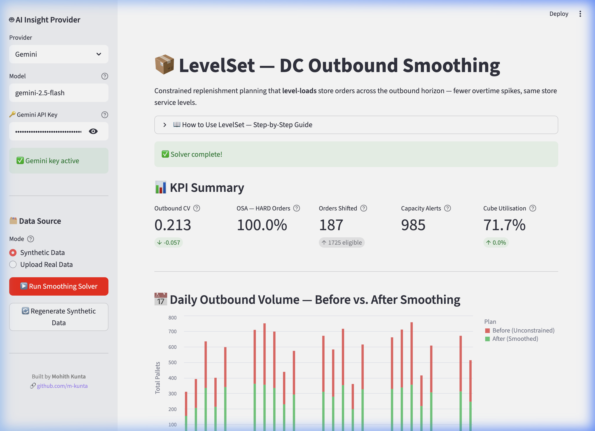
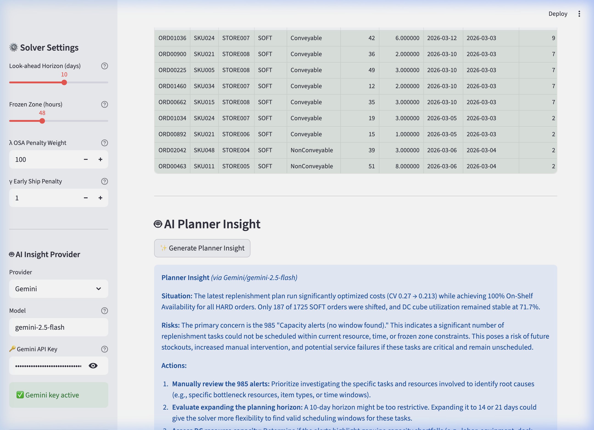
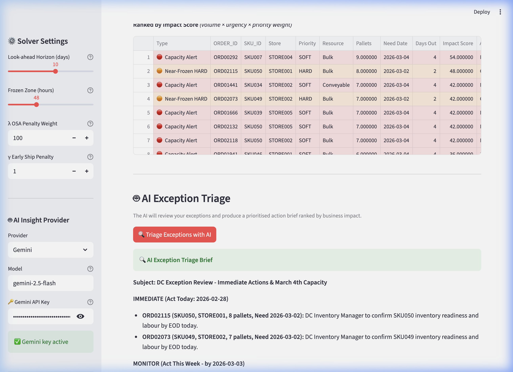

# 📦 LevelSet — DC Outbound Smoothing

> **Constrained Replenishment Planning for Distribution Centers**

**Author:** Mohith Kunta · [github.com/m-kunta](https://github.com/m-kunta)  
**Domain:** Supply Chain Planning / DC Replenishment  
**Stack:** Python · Streamlit · SQLite · SciPy · Altair · Google Gemini (optional)  
**Status:** ✅ Built & Running

---

## The Problem

DC outbound plans built purely off store need dates spike on two or three days and go quiet on others. Stores get replenishment on time — but the DC runs overtime on peak days and sits idle on trough days. Over a 4-week period, that pattern is expensive and entirely avoidable.

**LevelSet** treats DC outbound throughput as a constrained resource and proactively shifts "soft" replenishment orders into available capacity windows — before the wave happens, not after.

---

## How It Works

The solver classifies each order as **HARD** (safety stock breach, promo launch) or **SOFT** (routine fill, inventory build). HARD orders are pinned to their need date. SOFT orders are eligible for smoothing across a configurable look-ahead horizon, subject to four guardrails:

| Guardrail | What it checks |
|---|---|
| DC Capacity | Outbound throughput by resource type (Conveyable, Non-Conveyable, Bulk) |
| Store Calendar | Order can only ship on days the store takes deliveries |
| Inventory Readiness | No pull-forward if on-hand stock or ASN hasn't arrived yet |
| Shelf-Life (MRSL) | Move must not push product outside its freshness window |

If a valid trough window exists, the order is pulled forward. If not, it surfaces as a **Capacity Alert** for planner review.

See [REQUIREMENTS.md](REQUIREMENTS.md) for full solver logic, objective function, data feed specs, and KPI targets.

---

## Features

### 🔧 Core Solver

- Greedy smoothing engine with configurable horizon (5–14 days) and frozen zone (24–96h)
- Tunable λ (OSA penalty) and γ (early-ship penalty) weights via sidebar sliders
- Unit conversion: cases → pallets → capacity comparison
- Before/after CV, OSA, cube utilisation KPIs

### 📊 Dashboard



- **KPI Scorecards** — Outbound CV, OSA (HARD orders), shifted orders, alerts, cube utilisation
- **Before/After Bar Chart** — Red (unconstrained) vs. green (smoothed) daily volume
- **Smoothed Ship Schedule** — Filterable table with colour-coded rows (green = moved, red = alert)
- **Reset Synthetic Data** — Regenerate the database and re-run the solver in one click

---

### 🤖 AI Planner Insight



**Location:** Dashboard → between Schedule Table and Exception Review

A high-level AI briefing of the full plan. After running the solver, click **✨ Generate Planner Insight** to receive a 150-word "Situation → Actions" summary that covers:

- What the solver achieved (CV change, OSA, orders shifted)
- Risks from any unresolved capacity alerts
- 2–3 specific recommended actions (adjust λ, expand horizon, manual review)

**Prompt design:** The LLM receives structured solver KPIs and is instructed to produce an operations-team brief — not an executive summary. Output is direct and actionable.

**To enable:** Add your API key to `.env` (copy `.env.example` as a template):
```
GEMINI_API_KEY=your_key_here
```
Supports: Gemini, OpenAI, Anthropic, Groq, Ollama (switchable via sidebar dropdown).

---

### 🚨 AI Exception Triage



**Location:** Dashboard → Exception Review section (below AI Planner Insight)

Exception-based review capability that automatically classifies, scores, and ranks plan exceptions so planners can focus on the highest-impact items first. Consists of two layers:

#### Automated Exception Classification

Each exception is typed and scored by business impact:

| Type | Colour | What it flags | Impact Formula |
|---|---|---|---|
| 🔴 Capacity Alert | Red | SOFT orders with no valid trough window | `pallets × urgency × 1` |
| 🟠 Near-Frozen HARD | Orange | HARD orders shipping in ≤72h — confirmation window | `pallets × (4−days) × 3` |
| 🟡 Day Over-Capacity | Yellow | Days still above DC ceiling after smoothing | `overflow_pallets × urgency` |

Urgency decays linearly as the need date moves further out (`urgency = max(10 − days_out, 1)`), so imminent exceptions always rank above distant ones of equal volume.

#### AI Triage Brief

Click **🔍 Triage Exceptions with AI** to send the top 10 exceptions (ranked by Impact Score) to the AI. The output is structured as:

- **IMMEDIATE** — act today (specific action, owner, deadline)
- **MONITOR** — act this week
- **WATCH** — low risk, keep an eye
- Systemic pattern callouts (e.g. "Bulk resource consistently over-capacity")
- Headline: total pallets at risk if no action is taken

This feature requires an API key configured in `.env` (same as Planner Insight above).

---

## Key KPIs

| Metric | Target |
|---|---|
| Outbound CV (σ/μ) | < 0.15 |
| On-Shelf Availability (OSA) | ≥ 98.5% |
| Overtime Reduction | −12% |
| Cube Utilization | +5% |

---

## Quick Start

```bash
git clone https://github.com/m-kunta/dc-outbound-smoothing
cd dc-outbound-smoothing
python3 -m venv .venv && source .venv/bin/activate
pip install -r requirements.txt

# Optional: configure AI providers
cp .env.example .env
# Edit .env and add your API key

# Generate synthetic data
python data_gen.py

# Launch dashboard
streamlit run app.py
```

Open [http://localhost:8501](http://localhost:8501) in your browser.

---

## Project Structure

```
dc_outbound_smoothing/
├── app.py              # Streamlit dashboard (solver controls, charts, AI panels)
├── solver.py           # Smoothing engine: classify → convert → check → smooth → KPIs
├── data_gen.py         # Synthetic 30-day dataset generator (5 SQLite tables)
├── llm_providers.py    # Multi-provider AI client (Gemini, OpenAI, Anthropic, Groq, Ollama)
├── levelset.db         # Generated SQLite database (git-ignored)
├── requirements.txt    # Python dependencies
├── .env.example        # Environment variable template
├── REQUIREMENTS.md     # Full BRD: solver logic, data specs, objective function
└── README.md           # This file
```

---

## Open Issues / Pending QA

The backend solver, synthetic data generation, and API integrations have been thoroughly tested (`test_backend.py`) and all P0/P1 defects (e.g., CV worsening due to strict guardrails, Python 3.9 type annotations) have been resolved.

**Pending Tasks:**
- **Frontend / UI Testing:** Manual or browser-driven QA of the Streamlit dashboard (chart rendering, table filtering, KPI updates).
- **Edge Case Validation:** Testing with extremely large datasets or boundary inputs via the UI.
- **Export Verification:** Ensure CSV/JSON exports match the UI state accurately.

---

*Mohith Kunta — Supply Chain & AI Portfolio*  
*[github.com/m-kunta](https://github.com/m-kunta)*
